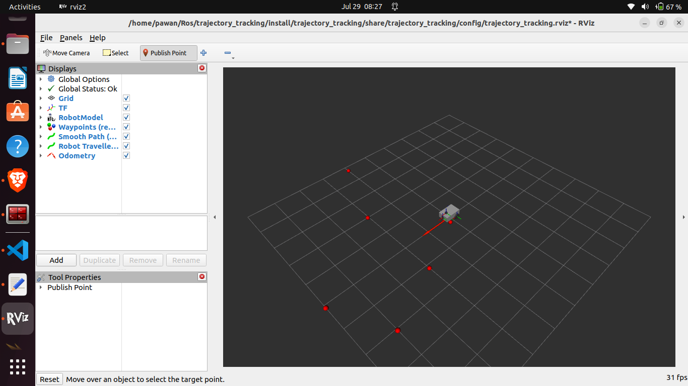
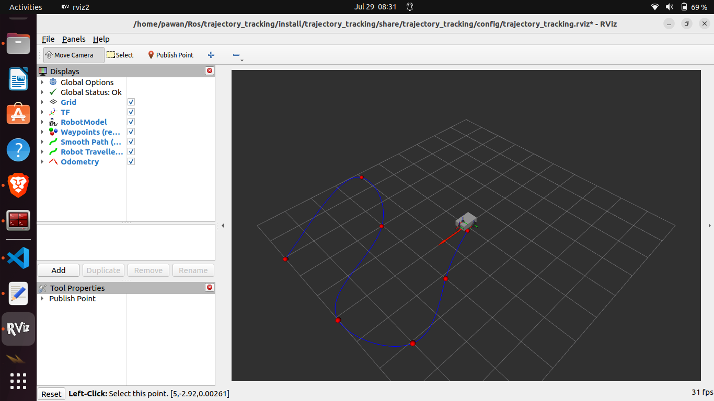
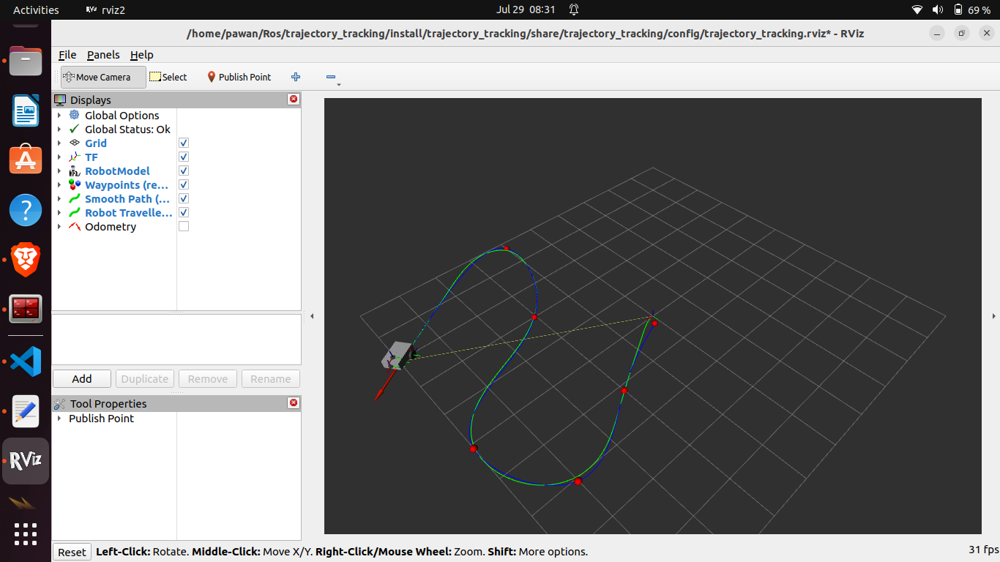
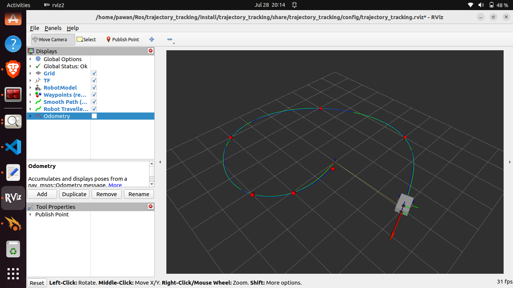
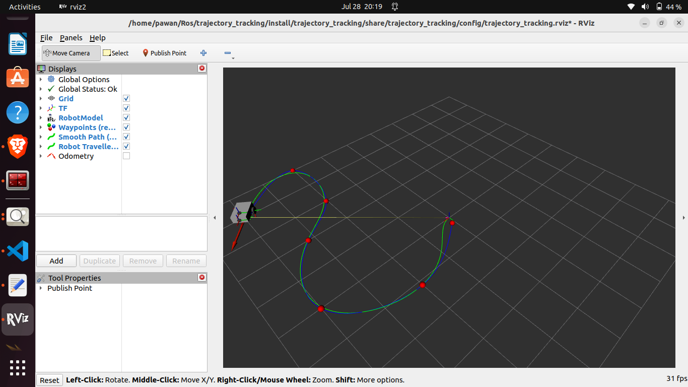

# ROS 2 Path Smoothing & Trajectory Tracking

A from-scratch ROS 2 Humble pipeline for **waypoint collection → cubic-spline path smoothing → constant-velocity time parameterization → time-indexed trajectory tracking** on a differential-drive robot.

This project implements the path smoothing, trajectory generation, and trajectory tracking stages without relying on Nav2 planning or controller plugins.


This package focuses on converting a set of user-selected 2D waypoints into a smooth trajectory and making the robot track it.

---

## Demo Video

**Demo video:** Add the final 3–5 minute demonstration video link here.

Example:

```text
https://youtu.be/YOUR_VIDEO_ID
```

---

## 1. Project Overview

| Stage | Node | Input | Output | Algorithm |
|---|---|---|---|---|
| 1 | `waypoint_collector.py` | `/clicked_point` | `/raw_waypoints`, `/waypoint_markers` | Collect N waypoints (default: 7) |
| 2 | `path_smoother.py` | `/raw_waypoints` | `/smooth_path` | Parametric natural cubic spline |
| 3 | `trajectory_generator.py` | `/smooth_path` | `/trajectory` | Constant-velocity time parameterization |
| 4 | `trajectory_controller.py` | `/odom`, `/trajectory` | `/cmd_vel` | Time-indexed tracking with Pure-Pursuit-style curvature |
| 5 | `rviz_visualizer.py` | `/odom` | `/robot_path` | Actual travelled-path visualization |

The current implementation automatically starts processing after **7 waypoints** are selected using RViz's **Publish Point** tool. The number of required waypoints is configurable.

---

## 2. System Architecture

```text
                     RViz "Publish Point" Tool
                              │
                              │ /clicked_point
                              ▼
                    ┌─────────────────────┐
                    │ Waypoint Collector  │
                    └──────────┬──────────┘
                               │
                               ├── /waypoint_markers
                               │      (input-point visualization)
                               │
                               │ /raw_waypoints
                               ▼
                    ┌─────────────────────┐
                    │    Path Smoother    │
                    │    Cubic Spline     │
                    └──────────┬──────────┘
                               │
                               │ /smooth_path
                               ▼
                    ┌─────────────────────┐
                    │Trajectory Generator │
                    │ Time Parameterizer  │
                    └──────────┬──────────┘
                               │
                               │ /trajectory
                               ▼
                    ┌─────────────────────┐
        /odom ─────▶│Trajectory Controller│────▶ /cmd_vel
                    └─────────────────────┘           │
                                                     ▼
                                          Differential-Drive Robot

        /odom
          │
          ▼
    ┌───────────────────┐
    │ RViz Visualizer   │
    └─────────┬─────────┘
              │
              └──▶ /robot_path
```

---

## 3. ROS 2 Interfaces

### Topics

| Topic | Message Type | Publisher | Subscriber(s) |
|---|---|---|---|
| `/clicked_point` | `geometry_msgs/PointStamped` | RViz | `waypoint_collector` |
| `/raw_waypoints` | `nav_msgs/Path` | `waypoint_collector` | `path_smoother` |
| `/waypoint_markers` | `visualization_msgs/MarkerArray` | `waypoint_collector` | RViz |
| `/smooth_path` | `nav_msgs/Path` | `path_smoother` | `trajectory_generator`, RViz |
| `/trajectory` | `trajectory_tracking/Trajectory` | `trajectory_generator` | `trajectory_controller` |
| `/odom` | `nav_msgs/Odometry` | Robot stack | `trajectory_controller`, `rviz_visualizer` |
| `/cmd_vel` | `geometry_msgs/Twist` | `trajectory_controller` | Robot stack |
| `/robot_path` | `nav_msgs/Path` | `rviz_visualizer` | RViz |

### Custom Messages

`TrajectoryPoint.msg`

```text
float64 x
float64 y
float64 theta
float64 velocity
float64 time_from_start
```

`Trajectory.msg`

```text
std_msgs/Header header
TrajectoryPoint[] points
```

---

## 4. Algorithms and Mathematical Formulation

### 4.1 Waypoint Collection

The user selects 2D points interactively in RViz using the **Publish Point** tool.

Each click publishes:

```text
/clicked_point
```

as a `geometry_msgs/PointStamped`.

The waypoint collector stores the points until the configured number of waypoints is reached. The default is:

```text
num_waypoints = 7
```

After the seventh point is received, the collected waypoints are published automatically as a `nav_msgs/Path` on:

```text
/raw_waypoints
```

This fixed-count trigger was selected to keep the assignment implementation simple and deterministic within the available development time.

---

### 4.2 Path Smoothing — Parametric Natural Cubic Spline

The raw waypoints are discrete and may contain abrupt direction changes. A parametric cubic spline is therefore used to generate a smooth path.

For waypoints:

```text
P0, P1, ..., Pn
```

the cumulative chord-length parameter is:

```text
s0 = 0

si = s(i-1) + ||Pi - P(i-1)||
```

Two independent cubic splines are then fitted:

```text
x = x(s)
y = y(s)
```

using:

```python
CubicSpline(..., bc_type="natural")
```

A natural cubic spline sets the **second derivative to zero at the endpoints**.

Using a parametric representation avoids the limitation of expressing the path only as `y = f(x)`, which can fail when the path turns back in the X direction.

The spline is sampled at approximately:

```text
0.05 m
```

intervals by default.

The resulting dense path is published as:

```text
/smooth_path
```

using `nav_msgs/Path`.

---

### 4.3 Trajectory Generation — Constant-Velocity Time Parameterization

A path describes **where** the robot should move.

A trajectory additionally describes **when** the robot should reach each point.

For each point on the smoothed path, cumulative distance is calculated. With a constant cruise velocity:

```text
v_cruise = 0.5 m/s
```

by default, the timestamp is calculated as:

```text
ti = di / v_cruise
```

where:

- `di` = cumulative distance from the beginning of the path
- `v_cruise` = desired reference velocity
- `ti` = time from trajectory start

The heading is calculated from consecutive path points:

```text
theta_i = atan2(y(i+1) - yi, x(i+1) - xi)
```

Each generated trajectory point contains:

```text
x
y
theta
velocity
time_from_start
```

The final trajectory point has a reference velocity of zero to support stopping at the goal.

The generated trajectory is published on:

```text
/trajectory
```

---

### 4.4 Trajectory Tracking — Time-Indexed Controller with Pure-Pursuit-Style Curvature

The controller subscribes to:

```text
/trajectory
/odom
```

and publishes:

```text
/cmd_vel
```

When a new trajectory is received, the controller stores it and starts a trajectory clock.

At each control cycle, running at **20 Hz by default**, elapsed time is calculated:

```text
elapsed_time = current_time - trajectory_start_time
```

The controller finds the two trajectory points surrounding the current elapsed time and interpolates between them to obtain the current reference state:

```text
(x_ref, y_ref, theta_ref, v_ref)
```

This makes the controller **time-indexed** rather than selecting the nearest waypoint.

For the current robot pose:

```text
(x, y, theta)
```

the positional errors are:

```text
dx = x_ref - x
dy = y_ref - y

distance_error = sqrt(dx² + dy²)
```

The direction from the robot toward the current reference point is:

```text
target_heading = atan2(dy, dx)
```

and heading error is:

```text
heading_error = normalize(target_heading - theta)
```

The controller uses a Pure-Pursuit-style curvature relation:

```text
curvature = 2 * sin(heading_error) / max(distance_error, epsilon)
```

Linear velocity combines the trajectory feed-forward velocity with distance-error feedback and a heading-dependent taper:

```text
v = (v_ref + k_distance * distance_error) * heading_taper
```

Angular velocity is then calculated from:

```text
omega = curvature * v
```

Both commands are limited by configurable maximum linear and angular velocities before being published as `geometry_msgs/Twist`.

The robot stops when the trajectory duration has completed and the robot is within the configured final-position tolerance.

> Note: this controller is described as a **time-indexed trajectory tracking controller using a Pure-Pursuit-style curvature law**. It is not intended to be presented as a conventional spatial-lookahead Pure Pursuit implementation.

---

## 5. RViz Visualization

The system provides three useful visual outputs:

- **Waypoint markers** — original user-selected waypoints
- **Smoothed reference path** — generated cubic-spline path
- **Robot path** — actual path travelled using odometry

This allows the desired and actual trajectories to be compared visually during execution.

Suggested visualization convention:

```text
Red markers  → selected waypoints
Blue path    → smoothed reference path
Green path   → actual travelled path
```

---

## 6. Package Layout

```text
trajectory_tracking/
├── CMakeLists.txt
├── package.xml
├── README.md
├── launch/
│   └── trajectory_tracking.launch.py
├── config/
│   └── trajectory_tracking.rviz
├── msg/
│   ├── TrajectoryPoint.msg
│   └── Trajectory.msg
├── test/
│   └── test_utils.py
└── trajectory_tracking/
    ├── __init__.py
    ├── utils.py
    ├── waypoint_collector.py
    ├── path_smoother.py
    ├── trajectory_generator.py
    ├── trajectory_controller.py
    └── rviz_visualizer.py
```

---

## 7. Prerequisites

The current project was developed for a ROS 2 Humble simulation environment.

Required software includes:

- Ubuntu with ROS 2 Humble
- Gazebo simulation environment
- RViz2
- Python 3
- NumPy
- SciPy
- pytest for unit testing

A working differential-drive robot simulation providing `/odom` and accepting `/cmd_vel` is required.

---

# 8. Build and Run

## Prerequisites

Before running this project, make sure the following software is installed:

- Ubuntu 22.04
- ROS 2 Humble
- Gazebo
- RViz2
- Python 3
- NumPy
- SciPy
- `ros_gz_bridge`
- `ros2_control`
- A differential-drive robot simulation that publishes `/odom` and accepts `/cmd_vel`

---

## Build the Package

Clone or copy the package into the `src` directory of your ROS 2 workspace.

```bash
cd ~/ros2_ws/src
git clone <repository_url>

cd ~/ros2_ws

colcon build --packages-select trajectory_tracking

source install/setup.bash
```

---

# Running the Project

The project uses **two launch files**.

The first launch file starts the complete simulation environment, while the second launch file starts the trajectory-tracking pipeline.

---

## Terminal 1 – Start the Simulation Environment

Launch the simulation using:

```bash
ros2 launch <your_robot_package> display.launch.py
```

This launch file starts:

- Gazebo simulation
- Differential-drive robot
- RViz2
- Gazebo ↔ ROS 2 Bridge
- TF tree
- `/odom`
- `/cmd_vel`

The purpose of this launch file is to prepare the robot simulation before running the trajectory tracking pipeline.

After launching, verify that:

- The robot is visible in Gazebo.
- The robot model is displayed in RViz.
- TF frames are available.
- `/odom` is being published.

You can verify this using:

```bash
ros2 topic list
```

Expected topics include:

```text
/odom
/cmd_vel
/tf
/tf_static
/joint_states
```

---

## Terminal 2 – Start the Trajectory Tracking Pipeline

Open a new terminal.

Source the workspace:

```bash
source ~/ros2_ws/install/setup.bash
```

Launch the trajectory tracking package:

```bash
ros2 launch trajectory_tracking trajectory_tracking.launch.py
```

This launch file starts the following ROS 2 nodes:

- `waypoint_collector_node`
- `path_smoother_node`
- `trajectory_generator_node`
- `trajectory_controller_node`
- `rviz_visualizer_node`

Each node performs one stage of the complete trajectory-tracking pipeline.

---

## Running the System

Once both launch files are running:

### Step 1

Open RViz.

Select the **Publish Point** tool.

---

### Step 2

Click **7 points** on the ground to define the desired path.

Each click publishes:

```text
/clicked_point
```

The Waypoint Collector stores these points.

---

### Step 3

After the seventh waypoint is received:

- The raw waypoints are published.
- The Path Smoother generates a smooth cubic spline.
- The Trajectory Generator assigns timestamps to each point.
- The Trajectory Controller starts following the generated trajectory automatically.

No additional keyboard input or service call is required.

---

## RViz Visualization

During execution, RViz displays:

### Red Markers

Original user-selected waypoints.

### Blue Path

Smooth reference path generated using the cubic spline.

### Green Path

Actual path travelled by the robot using odometry.

When the controller is properly tuned, the green path closely follows the blue reference path.

---

## Launch Workflow

```text
Terminal 1

display.launch
│
├── Gazebo
├── Robot Spawn
├── Gazebo ↔ ROS2 Bridge
├── RViz2
├── TF
├── /odom
└── /cmd_vel

        │
        ▼

Terminal 2

trajectory_tracking.launch.py
│
├── waypoint_collector_node
├── path_smoother_node
├── trajectory_generator_node
├── trajectory_controller_node
└── rviz_visualizer_node

        │
        ▼

Click 7 Waypoints in RViz

        │
        ▼

Path Smoothing

        │
        ▼

Trajectory Generation

        │
        ▼

Trajectory Tracking

        │
        ▼

Robot follows the generated trajectory
```

---

## Configurable Parameters

The main launch parameters can be modified as required.

| Parameter | Description | Default |
|-----------|-------------|---------|
| `num_waypoints` | Number of user-selected waypoints | 7 |
| `sample_spacing` | Distance between sampled spline points | 0.05 m |
| `cruise_velocity` | Constant trajectory velocity | 0.5 m/s |
| `control_frequency` | Controller update frequency | 20 Hz |

Example:

```bash
ros2 launch trajectory_tracking trajectory_tracking.launch.py \
    num_waypoints:=7 \
    sample_spacing:=0.05 \
    cruise_velocity:=0.5 \
    control_frequency:=20.0
```

# 9. Results

The proposed trajectory tracking pipeline was successfully implemented and tested in a Gazebo simulation using a differential-drive robot.

The system successfully performs the complete pipeline from user-defined waypoints to robot motion without relying on Nav2 planning or controller plugins.

The workflow is shown below:

```text
User selects waypoints in RViz
            │
            ▼
Waypoint Collection
            │
            ▼
Path Smoothing (Natural Cubic Spline)
            │
            ▼
Trajectory Generation
            │
            ▼
Trajectory Tracking Controller
            │
            ▼
Velocity Commands (/cmd_vel)
            │
            ▼
Differential-Drive Robot
```

---

## Waypoint Collection

The user selects waypoints interactively using the **Publish Point** tool in RViz.

After the configured number of waypoints (default: **7**) is collected, the system automatically starts the trajectory generation pipeline without requiring any additional user input.

---

## Path Smoothing Results

The raw waypoints are converted into a smooth path using **Natural Parametric Cubic Spline Interpolation**.

Compared to straight-line connections, the generated spline:

- Produces a continuous and smooth path.
- Eliminates sharp corners between waypoints.
- Generates evenly spaced intermediate points.
- Provides a path that is easier for the robot to follow.

---

## Trajectory Generation Results

The smoothed path is converted into a time-parameterized trajectory using a constant cruise velocity.

Each trajectory point contains:

- Position (x, y)
- Heading (θ)
- Reference velocity
- Time from trajectory start

This allows the controller to determine the desired robot state at every instant during execution.

---

## Trajectory Tracking Results

The custom trajectory controller successfully tracks the generated trajectory using odometry feedback.

During execution, the controller continuously:

- Reads the robot's current position from `/odom`.
- Computes the desired reference point based on the elapsed time.
- Calculates distance and heading errors.
- Publishes linear and angular velocity commands on `/cmd_vel`.

After tuning the controller parameters, the robot closely follows the generated trajectory throughout the simulation.

---

## RViz Visualization

The execution can be monitored in RViz using three different visualizations:

| Visualization | Description |
|---------------|-------------|
| 🔴 Red Markers | User-selected waypoints |
| 🔵 Blue Path | Smoothed reference path generated by the cubic spline |
| 🟢 Green Path | Actual path travelled by the robot using odometry |

The close overlap between the **blue reference path** and the **green travelled path** demonstrates good trajectory tracking performance.

---

## Performance Observations

During initial testing, the robot exhibited noticeable tracking errors because the maximum linear and angular velocity limits were set conservatively.

Since the controller follows a **time-indexed trajectory**, low velocity limits prevented the robot from reaching the desired reference position on time.

After increasing the maximum linear and angular velocity limits within the capabilities of the simulated robot:

- Trajectory tracking accuracy improved significantly.
- The robot followed curved paths more smoothly.
- Oscillations were reduced.
- The travelled path closely matched the reference trajectory.

---

## Summary

The implemented ROS 2 pipeline successfully demonstrates:

- ✔ Interactive waypoint collection using RViz
- ✔ Smooth path generation using Natural Parametric Cubic Spline Interpolation
- ✔ Constant-velocity trajectory generation
- ✔ Time-indexed trajectory tracking
- ✔ Successful differential-drive robot control in Gazebo
- ✔ Real-time visualization of both reference and actual robot paths in RViz

The modular architecture also allows each stage of the pipeline to be extended or replaced independently, making the project suitable for future enhancements such as dynamic obstacle avoidance, trajectory replanning, or deployment on a real mobile robot.

---

## Result Screenshots

Add the following screenshots to demonstrate the system performance.

### 1. Waypoint Selection

*(Insert screenshot showing the red waypoint markers selected in RViz.)*





---

### 2. Smoothed Path

*(Insert screenshot showing the blue cubic-spline path generated from the selected waypoints.)*





---

### 3. Final Trajectory Tracking

*(Insert screenshot showing the green travelled path closely following the blue reference path.)*




## 10. Testing and QA

The project includes unit tests for the mathematical utility functions in:

```text
test/test_utils.py
```

The tests cover utility functionality such as:

- Angle normalization
- Euclidean distance
- Heading calculation
- Cumulative path distance
- Quaternion/yaw conversion
- Point interpolation
- Path-resampling helpers

Run the tests with:

```bash
python3 -m pytest test/test_utils.py -v
```

These tests allow the core mathematical helpers to be checked independently of the ROS 2 runtime.

### Current Testing Scope

The current implementation combines:

- Unit testing of mathematical helper functions
- Gazebo simulation testing
- RViz visual comparison of reference and actual paths
- Controller parameter tuning through repeated trajectory executions

Node-level automated integration tests are not currently implemented.

---

## 11. Design Decisions

### Why Cubic Spline?

Cubic splines provide a smooth path through the selected waypoints while avoiding abrupt direction changes between consecutive straight-line segments.

### Why Constant Velocity?

The assignment focuses on time-parameterized trajectory generation. A constant-velocity profile provides a simple and clear baseline:

```text
time = distance / velocity
```

It keeps the implementation understandable while still producing a valid time-indexed trajectory.

### Why a Custom Controller?

The goal of the project is to demonstrate the trajectory-generation and tracking pipeline directly. Therefore, the tracking controller was implemented in the package rather than using an existing Nav2 controller plugin.

### Why Seven Waypoints?

The current implementation uses seven waypoints as a deterministic trigger for automatically starting path generation.

This was chosen to keep waypoint collection simple within the assignment time constraint.

The number is configurable, and a service or GUI-based completion trigger would be preferable for a more general system.

---

## 12. Extending the System to a Real Robot

Several changes would be required before deploying this pipeline to physical hardware.

### State Estimation

Real wheel odometry accumulates drift. A more robust implementation could fuse:

- Wheel odometry
- IMU
- Additional localization sensors

using an EKF such as `robot_localization`.

### Velocity and Acceleration Constraints

Real motors cannot instantaneously change velocity.

A physical system should therefore use:

- Acceleration limits
- Deceleration limits
- Jerk limits
- Trapezoidal or S-curve velocity profiles

### Safety

A real deployment should include:

- Emergency stop
- `/cmd_vel` watchdog
- Stale-odometry detection
- Motor/controller fault handling
- Obstacle detection
- Velocity limits based on the physical platform

### Controller Tuning

Parameters such as:

```text
distance gain
maximum linear velocity
maximum angular velocity
goal tolerance
```

would need to be tuned for the physical robot's dimensions, wheelbase, motor response, payload, and operating surface.

---

## 13. Obstacle Handling — Proposed Extension

Obstacle detection and avoidance are **not implemented in the current version**.

A future extension could subscribe to:

```text
sensor_msgs/LaserScan
```

or:

```text
sensor_msgs/PointCloud2
```

and detect obstacles inside a forward safety region based on the robot footprint and stopping distance.

A basic first stage could implement a **safe-stop behaviour**:

```text
Obstacle detected
       ↓
Publish zero /cmd_vel
       ↓
Robot stops
```

A more advanced version could include local trajectory modification or replanning around the obstacle.

Nav2 integration could also be considered when global planning, costmaps, recovery behaviours, and dynamic obstacle handling are required.

---

## 14. Limitations

The current implementation has several intentional limitations:

- Waypoint execution starts after a fixed configured number of clicks.
- Constant velocity is used instead of an acceleration-constrained velocity profile.
- Dynamic obstacle avoidance is not implemented.
- No online trajectory replanning is performed.
- The controller was tuned primarily for the simulated differential-drive robot.
- Automated node-level integration testing is not yet included.
- Quantitative tracking metrics such as RMSE are not currently calculated.

---

## 15. Future Work

Potential improvements include:

- Unlimited waypoint collection
- Service-based or GUI-based trajectory-start trigger
- Trapezoidal or S-curve velocity profiles
- Acceleration and jerk constraints
- Quantitative trajectory tracking metrics
- Dynamic obstacle detection
- Local trajectory replanning
- Nav2 integration for global planning
- Alternative controllers such as MPC
- Automated ROS 2 integration tests using `launch_testing`
- Real differential-drive robot deployment

---

## 16. AI Tools Used

AI tools were used as development assistants during this assignment.

- **ChatGPT** — architecture discussion, ROS 2 concept clarification, controller analysis, debugging guidance, implementation review, and documentation review.
- **Claude** — code-generation assistance for parts of the ROS 2 package.

The generated code and design decisions were reviewed, executed, tested, tuned, and validated in ROS 2/Gazebo simulation before submission.

> Remove any AI tool from this section that was not actually used during development.

---

## 17. Screenshots

Create the following directory inside the repository:

```text
media/
    ├── waypoint_selection.png
    ├── smooth_path.png
    └── trajectory_tracking.png
```

### Test 1 Trajectory Tracking




### Test 2 Trajectory Tracking





### Test 3 Trajectory Tracking


The final trajectory-tracking screenshot should clearly show the actual travelled path closely following the generated reference path.

---

## 18. Conclusion

This project demonstrates an end-to-end ROS 2 trajectory-generation and tracking pipeline for a simulated differential-drive robot.

The implemented system:

1. Collects user-defined 2D waypoints from RViz.
2. Generates a smooth path using parametric natural cubic splines.
3. Converts the path into a constant-velocity time-parameterized trajectory.
4. Tracks the trajectory using a custom time-indexed controller with a Pure-Pursuit-style curvature law.
5. Publishes linear and angular velocity commands to the differential-drive robot.
6. Visualizes both the reference path and actual travelled path in RViz.

Simulation results demonstrate that, after controller tuning, the robot can closely follow the generated smooth trajectory. The modular ROS 2 architecture also provides a clear foundation for future extensions such as improved velocity profiles, obstacle handling, replanning, and real-robot deployment.